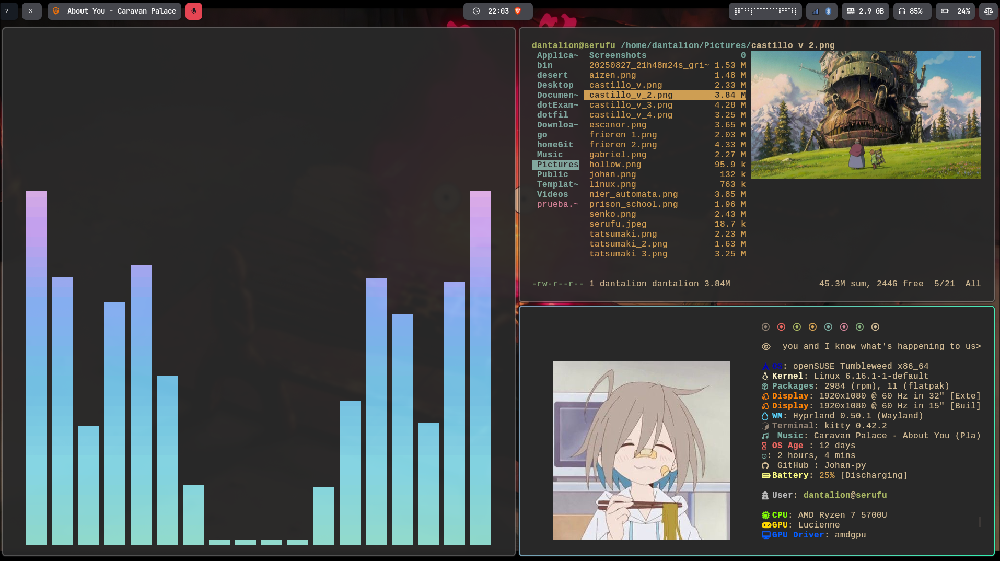
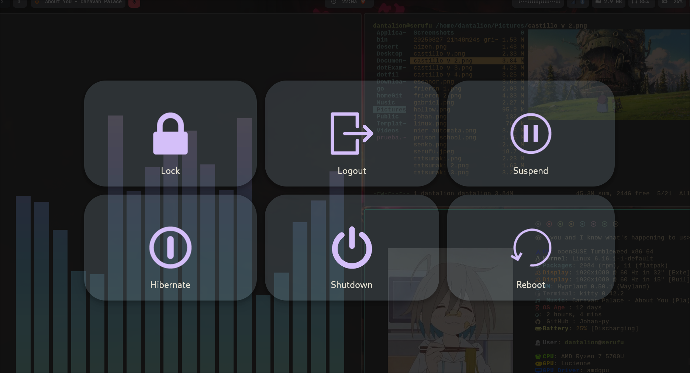
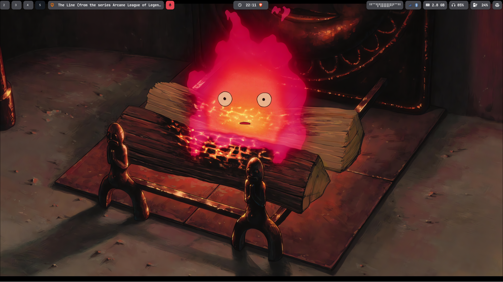

# Mis Dotfiles de Hyprland

Este repositorio contiene mi configuración personalizada de **Hyprland**, con todos los ajustes de ventanas, atajos, temas y scripts que uso en mi workflow diario. La idea es tener un entorno **ligero, funcional y estéticamente agradable**.

---

## 🖥️ Capturas de Pantalla

### Vista General

### Atajos y Scripts

### Tema y Personalización

---

## ⚙️ Archivos Destacados

- `config` → Configuración principal de Hyprland: atajos de teclado, reglas de ventanas y compositor.  
- `scripts/` → Scripts útiles para capturas de pantalla, gestión de monitores, etc.  
- `theme/` → Paleta de colores y ajustes visuales.

---

## 🚀 Características

- Atajos personalizados para capturas de pantalla (full, región, ventana).  
- Integración con `grim`, `slurp` y `swappy` para edición rápida.  
- Tema oscuro inspirado en **Gruvbox Material**.  
- Fluidez en múltiples monitores y manejo eficiente de ventanas.

---

## 📌 Nota

Esta configuración está optimizada para **Wayland** y para entornos basados en **Hyprland**. Puede requerir ajustes menores para otros compositores.
